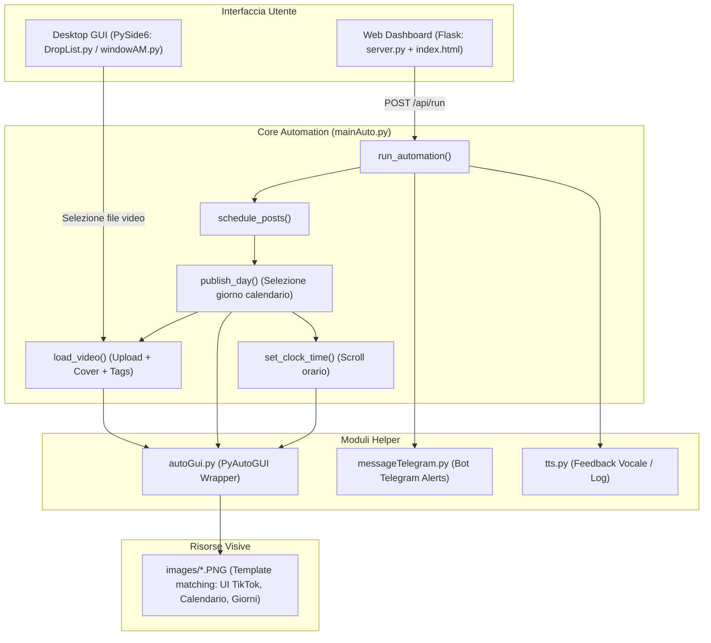
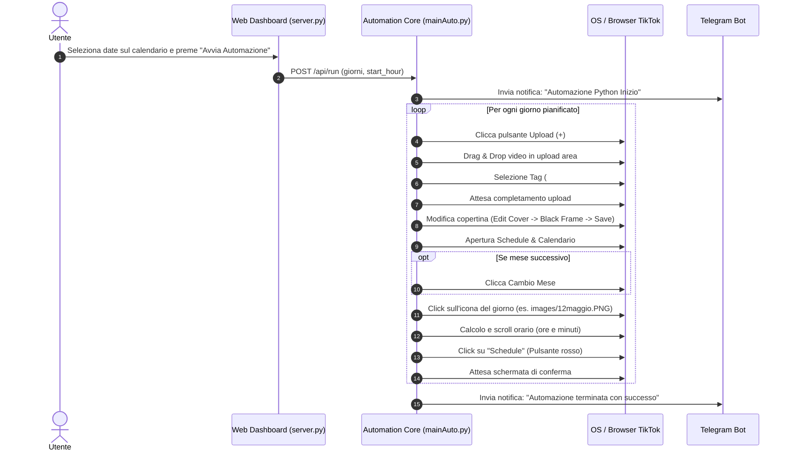

# ASTROMOSTRO Automation — Documentazione di Progetto

Sistema di **Desktop Robotic Process Automation (RPA)** integrato con una **Dashboard Web (Flask)** per il caricamento e la programmazione automatica di video su **TikTok** (formato oroscopo / *Astromostro*).

---

## 📐 1. Architettura del Sistema



---

## 📂 2. Struttura del Progetto

```text
Automation/
├── images/                  # Template visivi per PyAutoGUI (icone TikTok, pulsanti, giorni 1-31 per tutti i mesi)
├── static/                  # File statici web (CSS, JS)
│   └── index.css            # Stili per la dashboard web
├── templates/               # Template HTML per Flask
│   └── index.html           # Dashboard calendario interattivo per la schedulazione
├── autoGui.py               # Wrapper PyAutoGUI per ricerca immagini, click, drag&drop
├── autoDragDrop.py          # Script standalone / di supporto per test drag&drop Qt
├── DropList.py              # Finestra PySide6 per trascinamento e selezione video multipli
├── mainAuto.py              # CORE: Flusso completo automazione TikTok, upload, cover, calendario, orari
├── main.py                  # Entrypoint legacy per selezione file + automazione
├── messageTelegram.py       # Integrazione API Telegram per notifiche stato ed errori
├── server.py                # Backend Flask (porta 5001) per l'interfaccia di pianificazione
├── tts.py                   # Modulo Text-To-Speech per feedback audio/console
├── windowAM.py              # Finestra PySide6 per l'operazione di drag&drop del video nel browser
└── README.md                # Questa documentazione
```

---

## 🧩 3. Descrizione Dettagliata dei Moduli

### `server.py` & `templates/index.html` (Web Dashboard)
- **Scopo**: Fornisce un'interfaccia web visuale (porta `5001`) per selezionare i giorni dal calendario e l'ora di inizio.
- **Endpoint**:
  - `GET /`: Serve `index.html`.
  - `GET /api/config`: Restituisce i mesi italiani e le impostazioni predefinite.
  - `POST /api/run`: Riceve la lista dei giorni selezionati (`schedule_data`) e l'ora di inizio (`start_hour`), avviando `mainAuto.run_automation` in un thread separato.

### `mainAuto.py` (Core Automation)
- **Scopo**: Gestisce l'intera sequenza di interazioni grafiche con TikTok nel browser.
- **Funzioni chiave**:
  - `run_automation(schedule_data, start_hour_val)`: Entrypoint chiamato dal server web. Itera sui giorni selezionati e gestisce il flag di cambio mese.
  - `load_video()`: Esegue il drag&drop del video nell'area di upload di TikTok, seleziona i tag, attende il caricamento, apre `editCover`, seleziona il frame/anteprima e salva la copertina.
  - `set_clock_time(hours, minutes)`: Clicca sul selettore dell'orologio e simula gli scroll della rotellina del mouse per impostare ore e minuti specificati.
  - `publish_day(image_day, hours, minutes, cambioMeseDecision)`: Gestisce l'apertura del calendario, il cambio mese se necessario, la selezione del file immagine del giorno corrispondente (es. `images/15maggio.PNG`), l'impostazione dell'ora e il click finale su "Schedule".
  - `schedule_posts(...)`: Esegue la schedulazione calcolando intervalli temporali tra i post.

### `autoGui.py` (RPA Helper)
- **Scopo**: Incapsula le chiamate a `pyautogui` con gestione delle eccezioni e parametri standard di confidenza (`confidence=0.75` - `0.8`).
- **Metodi**: `imagePresent()`, `imageClick()`, `dragAndDrop()`, `moveToImageCenter()`.

### `windowAM.py` & `DropList.py` (Desktop GUI)
- **Scopo**: Componenti PySide6 (Qt) per consentire all'utente di selezionare i video dal filesystem e creare un widget draggable con l'icona `am.png` da trascinare nell'area di caricamento di TikTok.

### `messageTelegram.py` (Notifiche)
- **Scopo**: Invia messaggi Telegram di notifica all'avvio, al completamento o in caso di errore bloccante (es. elemento visivo non trovato).

### `tts.py` (Feedback Sonoro)
- **Scopo**: Fornisce indicazioni sullo stato dell'automazione (attualmente a console, con predisposizione per gTTS/pygame).

---

## 🔄 4. Flusso Operativo Completo (Workflow)



---

## 🚀 5. Come Avviare il Progetto

### Prerequisiti
- Python 3.10+
- Ambiente virtuale (`.venv`) attivo con dipendenze: `PySide6`, `pyautogui`, `opencv-python`, `flask`, `requests`, `pillow`.

### Avvio Server Web
```bash
python server.py
```
Accedere da browser all'indirizzo: `http://localhost:5001`

---

## ⚠️ 6. Punti Critici e Best Practice per Modifiche Future

1. **Risoluzione Schermo e DPI Scaling**:
   - `pyautogui.locateCenterOnScreen` dipende strettamente dalla risoluzione e dal fattore di scala (100%, 125%, 150%) di Windows. Se eseguito su VPS o monitor diverso, i template in `images/` potrebbero necessitare di riscatto.
2. **Hardcoded Credentials & Token**:
   - `TOKEN` e `CHAT_ID` in `messageTelegram.py` sono hardcoded. È consigliabile spostarli in un file `.env` o file di configurazione (`config.json`).
3. **Gestione Errori e Timeout**:
   - In `mainAuto.py`, le attese sono basate su `time.sleep()` con range casuali. Sarebbe preferibile usare polling con timeout espliciti su elementi visivi attesi per ridurre i tempi morti ed evitare desincronizzazioni.
4. **Server Flask in Debug Mode**:
   - In `server.py`, `app.run(debug=True)` può generare processi duplicati con il reloader di Flask. Per produzione locale è preferibile `debug=False` o `use_reloader=False`.
